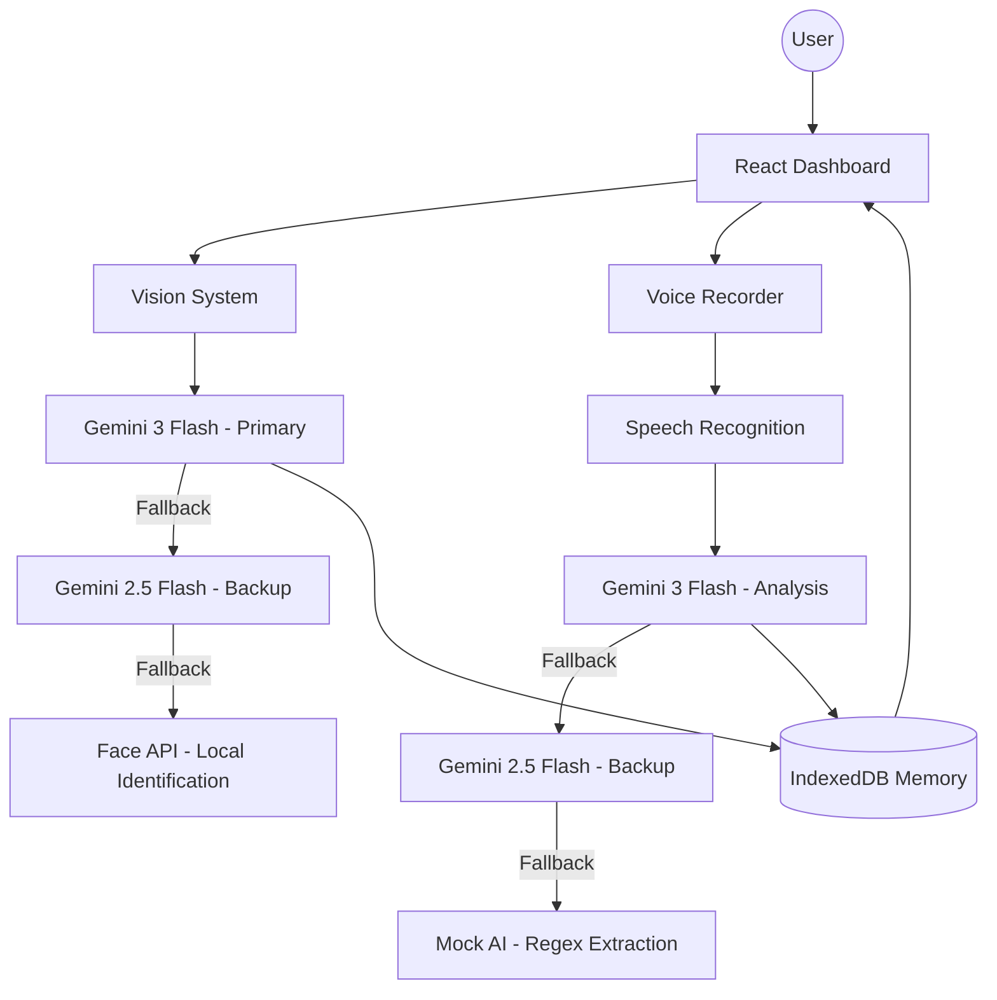

# Mnemosync | Recall • Reconnect • Reclaim

**Mnemosync** is an AI-powered companion designed specifically to assist individuals living with Alzheimer's and related dementias. By leveraging cutting-edge vision and conversation analysis, Mnemosync helps users recognize faces, recall past interactions, and stay on track with their daily routines.

## 🚀 Key Features

- **Intuitive Vision System**: Real-time facial recognition using Gemini 3 & 2.5 Flash, providing immediate context on who the user is talking to.
- **Hybrid AI Architecture**: A multi-tiered fallback system ensuring continuous operation.
  - **Primary**: Gemini 3 Flash (Context-rich analysis)
  - **Backup**: Gemini 2.5 Flash (Rate-limit resilient)
  - **Heuristic**: Regex-based Mock AI (Guaranteed task extraction)
- **Conversation Tracking**: Intelligent oral interaction monitoring that extracts tasks, promises, and calendar events automatically.
- **Memory Dashboard**: A visual history of interactions and upcoming tasks, designed for high legibility and cognitive ease.
- **Cinematic Experience**: A high-fidelity "Goddess of Memory" intro sequence to ease users into the experience.

## 🛠️ Tech Stack

- **Frontend**: React 19, Vite, TypeScript
- **Styling**: Vanilla CSS with modern Glassmorphism aesthetics
- **Animations**: Framer Motion
- **AI Models**: Google Gemini 3 Flash & 2.5 Flash
- **Vision**: React Webcam & Face API
- **Persistence**: IndexedDB (idb)

## 📦 Getting Started

### Prerequisites

- Node.js (v18 or higher)
- npm or yarn

### Installation

1. Clone the repository:
   ```bash
   git clone <repository-url>
   cd mnemosync
   ```

2. Install dependencies:
   ```bash
   npm install
   ```

3. Run the development server:
   ```bash
   npm run dev
   ```

The application is configured with an **inbuilt API key** for immediate hackathon evaluation. Simply launch and enjoy the experience.

## 🧠 The Architecture

Mnemosync uses a **Hybrid AI Strategy**. While Gemini 3 provides the deep reasoning required for social context, our backup systems ensure that critical \"Action Items\" (like taking medication or remembering a meeting) are never lost due to network errors or rate limits.

### System Diagram



## 💎 Gemini 3 Integration

Mnemosync leverages the advanced multimodal capabilities of **Gemini 3 Flash** as its core intelligence engine. 

1. **Context-Aware Vision**: We use Gemini 3's high-fidelity image analysis to not only recognize faces but to understand the *social context* of an interaction. It can distinguish between a friendly greeting and a focused conversation, providing the user with meaningful nudges based on visual cues.
2. **Intelligent Conversation Synthesis**: By feeding real-time transcripts into Gemini 3, the application extracts \"Memory Nuggets\"—short, ephemeral summaries of what was just discussed—and automatically identifies promises or tasks (e.g., \"I'll bring you water\") that are then persisted to the user's dashboard.
3. **Resilient Multimodal Fallback**: To satisfy the \"Functionality\" requirement of the hackathon, we implemented a unique hybrid architecture. If Gemini 3 encounters rate limits, the system seamlessly transitions to Gemini 2.5 Flash for continuous operation, ensuring that the Alzheimer's patient is never left without their digital companion.

---

*Developed for the Gemini 3 Hackathon 2026.*
